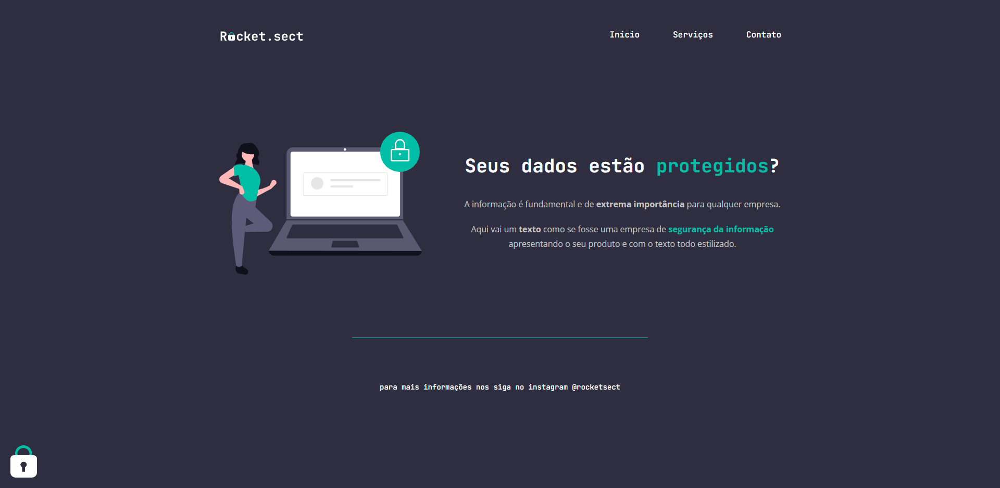

<h1 align="center">  
  
</h1>

  

## 💻 Sobre o desafio

Nesse desafio, foi solicitado a criação de uma aplicação a partir de um layout, para treinar o que foi ensinado até agora no **Stage 02**.

## 🔖 Layout

Você pode visualizar o layout do projeto através [desse link](<https://www.figma.com/file/EdKjPWjC8ZlbnH4XzTObv2/Explorer/duplicate>).

## 🚀 Tecnologias

Esse projeto foi desenvolvido com as seguintes tecnologias:

- HTML
- CSS